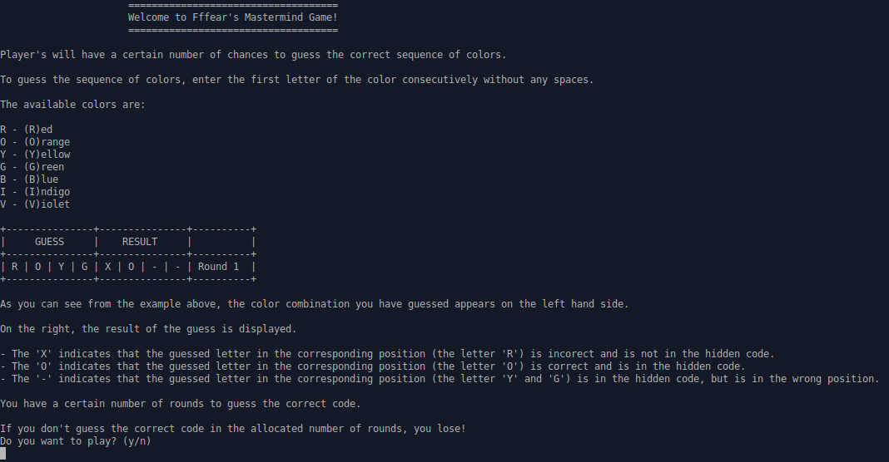
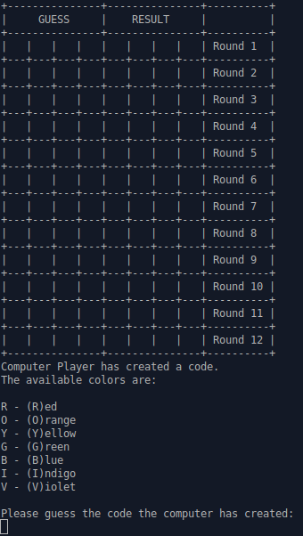
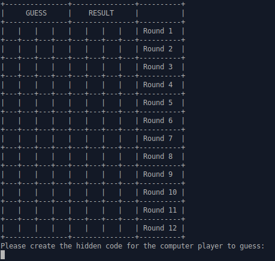

# Mastermind Game
This is a Mastermind game in Ruby, as part of the final OOP project in TheOdinProject Intermediate Course.

## Run the Game

To run the game, please ensure that you have Ruby installed on your machine.
Navigate into the folder which holds the `mastermind.rb` file, and type `ruby mastermind.rb` in the command line to start the game.

## Home Screen Game

Upon entering the game, the below should appear, giving a basic description of the game, and the format of the board.

Enter 'y' or 'n' to decide if you would like to play the game.

## Set Game Parameters

If you decide to proceed, you will then be able to set the game parameters, which will then determine the size of the board.

## Play as Either Guesser or Creator

You then have the option of choosing to play as either the guesser or creator.

If you play as the creator, the computer player will attempt to break your code.

## Helpful Links
- [The Odin Project](https://www.theodinproject.com/courses/ruby-programming/lessons/oop)
- [Wikipedia description on the game](http://en.wikipedia.org/wiki/Mastermind_(board_game))